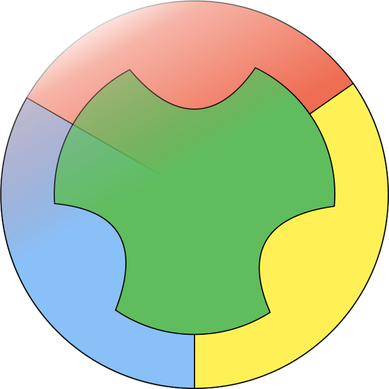

### Hi, I am

  

 🌱 I’m currently learning Advanced queries on SQL/MySQL

 <h2>Skills and Tools</h2>

<table>
  <tr>
    <td>
      <h3>Programming Languages</h3>
      <ul>
        <li> Python</li>
        <li> Java</li>
        <li> MATLAB</li>
        <li> Octave</li>
        <li><s> Turbo Pascal</s></li>
        <li><s> Proton Basic</s></li>
        <li><s> PIC Assembly</s></li>
      </ul>
    </td>
    <td>
      <h3>Frameworks and Technologies</h3>
      <ul>
        <li> Spring</li>
        <li> Spring Boot</li>
        <li> JSON</li>
        <li> JWT (JSON Web Tokens)</li>
        <li> MySQL</li>
        <li> SQLite</li>
      </ul>
    </td>
  </tr>
  <tr>
    <td>
      <h3>Development Tools and Environments</h3>
      <ul>
        <li> Git</li>
        <li> GitHub</li>
        <li> IntelliJ IDEA</li>
        <li> Neovim</li>
        <li>Visual Studio Code</li>
      </ul>
    </td>
    <td>
      <h3>Scientific and Mathematical Skills</h3>
      <ul>
        <li> Applied Electromagnetism</li>
        <li> Multi-variable Calculus</li>
        <li> Antennas Design</li>
        <li> Electronics</li>
      </ul>
    </td>
  </tr>
  <tr>
    <td>
      <h3>Operating Systems</h3>
      <ul>
        <li> Linux (Arch, Debian)</li>
        <li> Windows</li>
      </ul>
    </td>
    <td>
      <h3>Document Preparation</h3>
      <ul>
        <li> LaTeX</li>
      </ul>
    </td>
  </tr>
</table>

  
  

<!--
**emersondivB0/emersondivB0** is a ✨ _special_ ✨ repository because its `README.md` (this file) appears on your GitHub profile.

Here are some ideas to get you started:

- 🔭 I’m currently working on ...

- 👯 I’m looking to collaborate on ...
- 🤔 I’m looking for help with ...
- 💬 Ask me about ...
- 📫 How to reach me: ...
- 😄 Pronouns: ...
- ⚡ Fun fact: ...

-->

